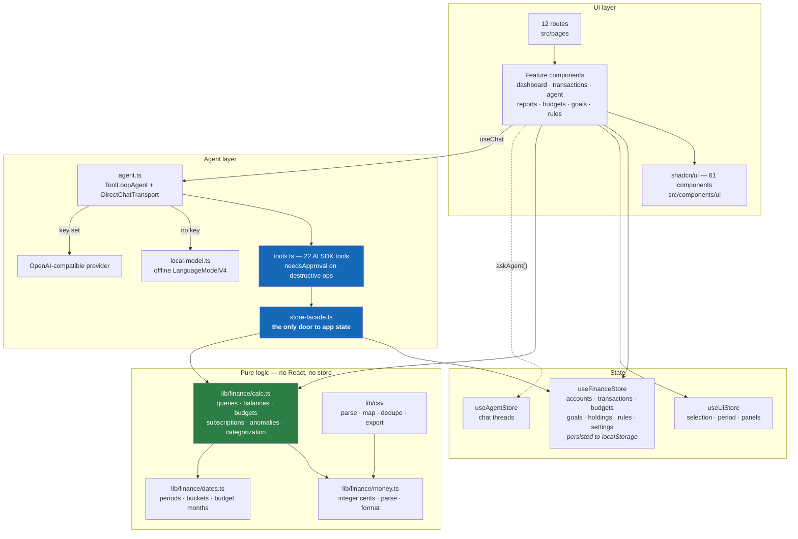

# Finora

**Your money, with an agent that actually works.**

An AI-first personal finance workspace: a spreadsheet-grade transaction sheet, budgets, goals and investments — plus a finance agent with 22 tools that can read *and* write your data, not just talk about it.

Local-first. Your ledger lives in `localStorage` and never leaves the browser. The only outbound traffic is the model call, and only when you configure a key.

```bash
pnpm install
pnpm dev          # http://localhost:5173
```

No API key required. Finora ships with a built-in offline agent so every feature is usable out of the box — see [The agent](#the-agent).

---

## Contents

- [What it does](#what-it-does)
- [Stack](#stack)
- [Architecture](#architecture)
- [The agent](#the-agent)
- [AI on the sheet](#ai-on-the-sheet)
- [Environment & security](#environment--security)
- [Project layout](#project-layout)
- [Data model](#data-model)
- [CSV import](#csv-import)
- [Keyboard shortcuts](#keyboard-shortcuts)
- [Scripts](#scripts)
- [Testing](#testing)
- [shadcn/ui component audit](#shadcnui-component-audit)
- [Design decisions](#design-decisions)
- [Out of scope](#out-of-scope-v1)

---

## What it does

| Route | What's there |
|---|---|
| `/` | KPI cards with period-over-period deltas, cashflow chart, spending donut, budget health, AI daily brief, insight carousel, recent activity |
| `/transactions` | The sheet: TanStack Table with sorting, multi-filter, inline editing, bulk actions, row context menus, CSV import/export, and an AI toolbar |
| `/accounts` | Balances (cleared vs pending), net worth, transfers between accounts, archive |
| `/budgets` | Monthly limits with pace-aware health scoring, AI-suggested limits from your history, unbudgeted-spend detection |
| `/goals` | Savings targets with deadline projections, required vs planned monthly contribution, on-track status |
| `/investments` | Holdings, market value, unrealised gain/loss, allocation charts (static prices — no live market data) |
| `/reports` | Period analysis across five tabs, AI narrative, subscription detection, CSV/Markdown export |
| `/rules` | Auto-categorization rules with a live match preview, plus rules inferred from your own history |
| `/agent` | Full-page agent workspace: thread history, tool capability reference, streaming chat |
| `/settings` | Currency, locale, salary-aligned budget months, theme, density, AI provider, backup/restore/reset |
| `/onboarding` | Four-step first-run wizard |

Ships with a realistic seeded dataset — a Paris household with freelance income: 3 accounts, 172 transactions across four months, 20 categories, 5 budgets for the current month, 3 goals, 4 holdings, 3 rules. It deliberately includes a duplicate charge, a 10× amount spike, paired transfers, pending rows, and 8 uncategorized transactions so the AI features have something real to find.

---

## Stack

| | |
|---|---|
| Build | Vite 8, TypeScript 6 (strict, no `any` in app code) |
| UI | React 19, Tailwind v4 (CSS-first), shadcn/ui preset `b7C9ulBMO` — `base-lyra` style, `mist` base, Instrument Sans |
| Primitives | Base UI (`@base-ui/react`) — **not** Radix |
| State | Zustand 5 + `immer` + `persist` |
| AI | Vercel AI SDK 7 (`ai`, `@ai-sdk/react`, `@ai-sdk/openai`) |
| Data grid | TanStack Table 8, TanStack Virtual 3 |
| Charts | Recharts 3 via shadcn `Chart` |
| Misc | react-router 7, Papa Parse, date-fns 4, Sonner, Zod 4, lucide-react |

---

## Architecture



Three rules hold this together:

1. **Business logic is pure.** Everything in `lib/finance` takes plain data and returns plain data — no React, no store access. That's why the agent and the UI can never disagree about a number: they call the same functions.
2. **The agent goes through one door.** Tools never touch Zustand directly. `store-facade.ts` is the entire read/write surface, so there is exactly one file to audit for "what can the AI do to my data", and tool results come back as model-friendly shapes (readable labels, pre-formatted currency) rather than raw records.
3. **Money is integer minor units.** €12.34 is `1234`, everywhere. Expenses negative, income positive. No float drift, no `toFixed` in components — formatting only ever happens through `useFormatters()`.

---

## The agent

Built on AI SDK 7's `ToolLoopAgent` with `DirectChatTransport`, which runs the agent **in the browser with no server route**. The agent gets runtime context on every turn: the current route, the rows you have selected in the grid, your currency and locale, and live counts from your ledger.

### The 22 tools

**Reads** — `listAccounts` · `listCategories` · `queryTransactions` · `runCashflowSummary` · `categoryBreakdown` · `detectSubscriptions` · `detectAnomalies` · `analyzeBudget` · `listGoals` · `listRules`

**Writes** — `createTransaction` · `updateTransactions` · `deleteTransactions` · `suggestCategories` · `applyCategories` · `createBudget` · `createGoal` · `updateGoalProgress` · `createRule` · `splitTransaction` · `exportSummaryMarkdown`

**Navigation** — `navigateTo` (the UI acts on the result and actually routes you there)

### Guardrails

- `deleteTransactions` **always** requires approval. `updateTransactions` requires it above 5 rows. `applyCategories` requires it when applied to everything. Approvals surface as an inline approve/deny card in the chat — nothing is auto-approved.
- Tools accept category and account **names**, not just ids, and resolve them fuzzily. A name that doesn't resolve returns `ok: false` with a message telling the model to call `listCategories` — a hallucinated id can't silently corrupt data.
- Transfers between your own accounts are excluded from spending and income everywhere, so internal movements never inflate a report.

### Offline mode

With no API key, `createFinanceModel` returns `FinoraLocalModel` — a `LanguageModelV4` implementation that routes your intent to the right tools and streams a reply built from **real tool results against your real data**. It handles briefing, subscriptions, anomalies, categorization, budgets, goals, rules, category breakdown, savings advice and balances.

It is an intent router, not a language model, and the UI says so: the header badge reads **Offline mode**, and the first message explains what it is. Add a key in Settings → AI and the same tool contracts run against a real model with full natural-language understanding.

---

## AI on the sheet

The transactions grid has its own AI toolbar that runs **locally and deterministically** — heuristics over your own history, no model call, nothing leaving the browser. The UI labels it that way rather than implying otherwise.

- **Suggest categories** — three passes: an identical payee you've already categorized (strongest signal), keyword matching for ~18 known merchant families, then a same-amount majority vote. Each suggestion carries a confidence and a plain-English reason, and lands in the grid for you to accept or reject per row, in bulk, or above a confidence threshold.
- **Detect anomalies** — exact duplicates, amounts far above a payee's own median, large first-time payees, uncategorized spend. Duplicates can be deleted with an undo toast.
- **Transform…** — natural-language edits with a **live preview before applying**: `split <payee> into Transport 80% / Meals 20%`, `categorize selected as Groceries`, `tag selected as review`, `mark selected as cleared`, `rename payee to X`.
- **Fill column…** — derive tags or memos by merchant type, amount band, account, or month.
- **Propose rules** — mines payees you've categorized consistently and offers them as rules, one click each.

---

## Environment & security

Copy `.env.example` to `.env.local` (git-ignored):

```bash
VITE_AI_API_KEY=      # any OpenAI-compatible key
VITE_AI_BASE_URL=     # blank for OpenAI; OpenRouter/Groq/Ollama supported
VITE_AI_MODEL=gpt-4o-mini
```

You can also paste a key at runtime in **Settings → AI** (stored in `localStorage`, never committed). Runtime settings take precedence over build-time env.

> **A `VITE_`-prefixed variable is inlined into the client bundle** and is visible to anyone who opens devtools. That's fine for local or self-hosted single-user use with a scoped key.
>
> **For a real deployment, do not ship a key.** Put a thin server route in front of the model that injects the secret server-side, and point the app at it:
> ```bash
> VITE_AI_BASE_URL=https://your-app.com/api/ai
> ```
> The provider is abstracted behind `createFinanceModel()` in `src/lib/ai/agent.ts`, so this is a one-line change. Because the agent is constructed with `DirectChatTransport`, swapping to a hosted route requires no changes to the tools or the chat UI.

---

## Project layout

```
src/
├── components/
│   ├── ui/                 61 shadcn components (vendored, treat as read-only)
│   ├── layout/             AppLayout · AppSidebar · AppHeader · CommandPalette · PeriodSwitcher
│   ├── agent/              AgentPanel · ToolResultCard · MiniMarkdown
│   ├── transactions/       TransactionsTable · Filters · BulkActionsBar · ImportCsvDialog
│   │                       AiGridToolbar · AiSuggestionsReview · AiAnomalyPanel
│   │                       NlTransformDialog · FillColumnDialog
│   ├── dashboard/          KpiCards · CashflowChart · SpendingDonut · BudgetHealth
│   │                       AIDailyBrief · InsightCarousel · RecentActivity · insights.ts
│   ├── reports/            5 tabs · AINarrativeCard · narrative.ts
│   ├── accounts/ budgets/ goals/ rules/ settings/ onboarding/
│   └── shared/             PageHeader · PageShell · PageSkeleton
├── lib/
│   ├── ai/                 store-facade · tools · agent · local-model
│   ├── finance/            calc · money · dates · hash        ← pure, testable
│   ├── csv/                parse · mapping · export
│   └── icons.ts  navigation.ts  utils.ts
├── stores/                 useFinanceStore · useUiStore · useAgentStore
├── hooks/useAppSettings.ts useFormatters · useThemeSync · useDensity
├── types/finance.ts        the whole domain model
├── data/sample.ts          deterministic seeded dataset
└── pages/                  12 routes
```

~20,000 lines of app code across 90 files, plus the vendored component kit.

---

## Data model

`src/types/finance.ts` is the single source of truth. Core entities:

- **Account** — type (`checking|savings|credit|cash|investment`), opening balance, currency, colour, archived. Live balance is *derived*, never stored.
- **Transaction** — signed amount in minor units, date, account, category, payee, memo, tags, status (`cleared|pending|reconciled`), `externalId` (dedupe hash), AI suggestion fields, and transfer pairing.
- **Category** — kind (`income|expense|transfer`), budgetable flag, icon, colour.
- **Budget** — `YYYY-MM` + category + limit + rollover. Spend is derived.
- **Goal** — target, current, deadline, monthly contribution, status.
- **Rule** — matcher (`payee_contains|payee_regex|memo_contains|amount_range`), category/tags to set, priority, times applied.
- **AppSettings** — currency, locale, `monthStartDay` (1–28, for salary-aligned budget months), theme, density, AI config.

Derived view models (`BudgetProgress`, `CashflowPoint`, `DetectedSubscription`, `Anomaly`, …) are computed on demand and never persisted.

---

## CSV import

Three-step wizard: upload → map → confirm.

- **Delimiter detection** — comma, semicolon, or tab.
- **Header guessing** — matches ~40 patterns across English, French, German, Spanish and Italian bank exports (`Date operation`, `Libellé`, `Montant`, `Betrag`, `Beschreibung`, `Concepto`, `Débit`/`Crédit`, …).
- **Amount parsing** — handles `1 234,56`, `1,234.56`, `-1.234,56`, `(12,34)`, `€1 234,56`, unicode minus, and NBSP. Signed single column *or* split debit/credit columns, with an invert-sign switch for banks that report expenses as positive.
- **Date parsing** — resolves day-first vs month-first from the **whole column**, not row by row: a single `07/09/2026` is ambiguous, but one `13/07/2026` anywhere in the column proves the order. The wizard displays which format it detected, and you can override it.
- **Deduplication** — by a stable hash of date + amount + normalized payee. Sample data and imports share one hash function, so re-importing a statement you already have is a no-op rather than a pile of duplicates.
- **Auto-categorization** — your rules run over the imported rows immediately, and the success toast reports how many were categorized.

Export writes machine-readable dot-decimal amounts alongside a locale-formatted display column, so a round trip through export → import is exact.

---

## Keyboard shortcuts

| Keys | Action |
|---|---|
| <kbd>⌘K</kbd> / <kbd>Ctrl K</kbd> | Command palette — navigate, or hand a task to the agent |
| <kbd>⌘J</kbd> / <kbd>Ctrl J</kbd> | Toggle the docked agent panel |
| <kbd>Enter</kbd> | Send in the composer / commit an inline cell edit |
| <kbd>Shift Enter</kbd> | Newline in the composer |
| <kbd>Esc</kbd> | Cancel an inline edit, close a dialog |
| <kbd>↑</kbd> <kbd>↓</kbd> | Move row focus in the grid |
| <kbd>Space</kbd> | Toggle row selection |

---

## Scripts

```bash
pnpm dev        # vite dev server
pnpm build      # tsc -b && vite build
pnpm preview    # serve the production build
pnpm lint       # oxlint
```

---

## Testing

Two headless-browser harnesses, both kept in the repo because they caught real bugs:

```bash
node scripts/smoke.mjs                  # all 11 routes: fails on console errors or blank pages
node scripts/smoke.mjs --dark           # dark mode
node scripts/smoke.mjs --mobile         # 390×844
node scripts/smoke.mjs --only /budgets  # one route
node scripts/e2e.mjs                    # 8 real interaction flows
```

`smoke.mjs` screenshots every route to `shots/`. `e2e.mjs` exercises: agent starter prompt streaming with a tool trace, composer follow-up, command-palette navigation, AI grid suggestions, inline edit persisting across a reload, budget over-limit state, dark-mode toggle, and mobile overflow.

A sample bank export is in `samples/bnp-releve-juillet.csv` for exercising the importer.

<details>
<summary><strong>Bugs these harnesses caught</strong> (worth reading if you're extending the app)</summary>

- `cmdk` crashed because `CommandDialog` renders children with no cmdk root — palette contents must be wrapped in `<Command>`.
- **react-resizable-panels v4 changed numeric `defaultSize` from percent to pixels.** `defaultSize={30}` produced a 30 *pixel* panel. Use strings: `"30%"`.
- A trailing empty `<MessageScrollerItem scrollAnchor />` made the Base UI scroller anchor a zero-height node to the viewport top and inflate its internal spacer by ~650px, pushing the whole conversation off-screen.
- CSV export wrote locale-formatted amounts (`-42,15`) unquoted into a comma-delimited file, so re-import silently misread every amount.
- Sample data and the importer hashed with different prefixes (`seed-` vs `imp-`), so dedupe never fired on re-import.
- Fixing that introduced a circular import (`sample → store → sample`) that evaluated to `undefined` outside the bundler — hence `lib/finance/hash.ts`.
- The categorizer suggested `Salary` for credit-card repayments, because the keyword `paie` matched "PAIEMENT".
- The subscription detector called supermarkets "weekly subscriptions" until an amount-stability gate was added.
- The main bundle was 1.2 MB because the layout imported the agent (and the whole AI SDK) eagerly; lazy-loading it behind Suspense cut the entry chunk to 566 kB (177 kB gzipped).

</details>

---

## shadcn/ui component audit

**58 of the 61 installed registry components are used in app code**, in functional roles rather than as decoration.

| Component | Where it earns its place |
|---|---|
| Sidebar | App shell — collapsible nav with live per-account balances and an uncategorized badge |
| Breadcrumb | Header trail |
| Menubar | Header Data / Agent menus |
| Command | ⌘K palette: navigation + agent prompts + actions |
| Table | Transactions grid, reports, holdings, import preview, import history |
| Checkbox, Pagination | Row selection and paging (virtualization takes over above 300 rows) |
| Chart | Cashflow area, spending donut, monthly bars, category trends, allocation |
| Message, MessageGroup, MessageAvatar, MessageContent, MessageHeader, MessageFooter | Agent chat structure |
| Bubble | Chat message bodies |
| Marker | Per-tool trace lines and step separators in the agent |
| MessageScroller | Autoscrolling chat viewport with scroll-to-end |
| Attachment | Chosen file in the CSV import wizard |
| Empty | Empty states on every list, plus the agent's starter-prompt screen |
| Item | Recent activity, thread list, rule proposals, onboarding features |
| Card | KPIs, accounts, goals, insight cards, settings panels |
| Badge | Status, tags, confidence bands, cadence, over-budget, AI/offline markers |
| Progress | Budget bars, goal progress, import progress, health score |
| Skeleton | Route-level and table loading states |
| Spinner | AI actions, streaming, parsing |
| Kbd | Shortcut hints in header, palette, onboarding, reset confirmation |
| Avatar | Chat and user menu |
| Dialog | CSV import, budget/goal/holding/rule forms, transforms |
| AlertDialog | Every destructive confirm (delete account, wipe data, delete rows) |
| Sheet | Account and goal editors, AI suggestion review, anomaly panel, mobile thread list |
| Drawer | Agent on mobile |
| Popover | Date pickers, tag editors, amount range, goal contributions, rule proposals |
| HoverCard | Net-worth breakdown per account |
| Tooltip | Every icon-only button, truncated payees, confidence explanations |
| DropdownMenu | Row actions, bulk categorize, column visibility, export menus |
| ContextMenu | Right-click on grid rows |
| Tabs | Dashboard chart modes, reports sections, settings sections, goal filters |
| Accordion | Settings FAQ, agent capability reference |
| Collapsible | Archived accounts, agent tool traces |
| Resizable | Docked agent panel, agent workspace two-pane |
| ScrollArea | Long lists and JSON tool output |
| Separator | Structural dividers |
| Field, FieldSet, FieldLegend, FieldGroup, FieldError | Every form, with inline validation |
| Label | Form control labelling |
| Input, Textarea | Text and amount entry |
| InputGroup | Search with addons, chat composer, API key show/hide |
| InputOTP | Typing `DELETE` to confirm wiping all data |
| Select | Accounts, categories, currency, locale, date formats |
| NativeSelect | Dense secondary pickers (budget month) |
| Combobox | Searchable category pickers |
| Calendar | Date cell editing, range filters, deadlines |
| Switch | Uncategorized filter, rollover, invert amounts, archived, rule enable |
| Slider | Amount-range filter, AI confidence threshold |
| RadioGroup | Onboarding data choice, fill-column strategy |
| Toggle | Per-row AI suggestion accept |
| ToggleGroup | Period switcher, direction filter, theme, density |
| Button, ButtonGroup | Actions throughout; grouped in the bulk and AI toolbars |
| Carousel | Dashboard insights, onboarding tips |
| AspectRatio | Keeps the donut chart square at narrow widths |
| Alert | Anomalies, overspend, import errors, offline notice, tool approvals |
| Sonner | All toasts, with undo where destructive |

**Deliberately not used** (three components, each for a concrete reason):

- **`toast`** — the app standardises on **Sonner**, mounted globally and themed from settings. The registry also ships a Base UI toast with its own manager; running two toast systems in one app is a bug, not a feature.
- **`navigation-menu`** — primary navigation is `Sidebar`, and the header's Data/Agent menus are `Menubar`. A third navigation paradigm in the same shell would be redundant rather than demonstrative.
- **`direction`** — an RTL/LTR provider utility, not a visual component. `components.json` sets `"rtl": false`; adding it would be dead code.

---

## Design decisions

**Preset colours only.** The theme is exactly what `b7C9ulBMO` produces — `base-lyra`, `mist` base, Instrument Sans, blue primary. That includes the deliberately monochrome chart ramp (`--chart-1` … `--chart-5`), so category identity is carried by icons and labels rather than hue. No one-off colour system, no hard-coded hex.

**Pace-aware budget health.** Scoring "money left" alone means a user who has spent 85% of their budget on the 27th scores 15/100, which is both technically true and useless. The score compares spend against *elapsed time* in the budget period, so on-pace spending stays in the 70–100 band and genuine overspend still falls away steeply.

**Honest AI labelling.** Offline mode says "Offline mode" and explains itself. Grid actions say they are local heuristics over your own history. Investment prices are labelled static. The app never implies a model call it isn't making.

**Salary-aligned months.** `monthStartDay` (1–28) shifts the whole budget window, so if you're paid on the 25th your budget month can run 25th → 24th. Every period calculation honours it.

**Derived, never duplicated.** Balances, budget spend, and goal progress are computed from transactions on demand. There is no stored total that can drift out of sync with the ledger.

---

## Out of scope (v1)

Open Banking / Plaid connections · multi-user auth · native mobile apps · tax filing · live market data.
